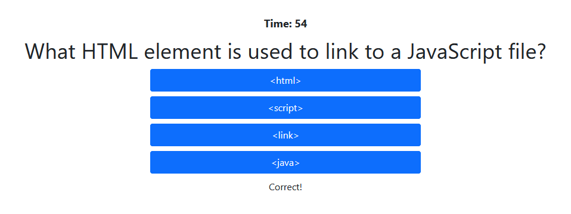

# Code_Quiz
## Code Description
This repository hosts an interactive quiz with code-based questions. It is coded using HTML, CSS (Bootstrap), and JavaScript. JavaScript is used to manipulate the page by:
1. Allowing the highscore to be viewed from the main menu.
2. Return to the main menu from the highscore page and the game end page.
3. Start the game.
4. Register button clicks to determine whether a right or wrong answer is selected that also shows if the selection is correct or incorrect.
5. Moves to the next question when a correct answer is selected.
6. Once the game is over, either by answering the last question correctly or running out of time, a highscore input page shown.
7. If the obtained score is less than or equal the stored score, then the score is not saved.
8. The score is saved in local storage.

## Game Rules
Welcome to the Coding Quiz Challenge! When you click the start button below, the timer will start to countdown as you race to finish the quiz. But beware: each wrong answer will cause a time penalty. Can you get to the end as quickly as possible and beat the high score?

## Live Link
https://riraq.github.io/Code_Quiz/

## Work-in-Progress Updates
- Save top three highscores
- Update code to be more dynamic; currently changes elements based off children, not elements
- Add sounds/music

## Screenshots
### Main Menu

### Question Right

### Question Wrong

### Game End

### Highscore Page 
